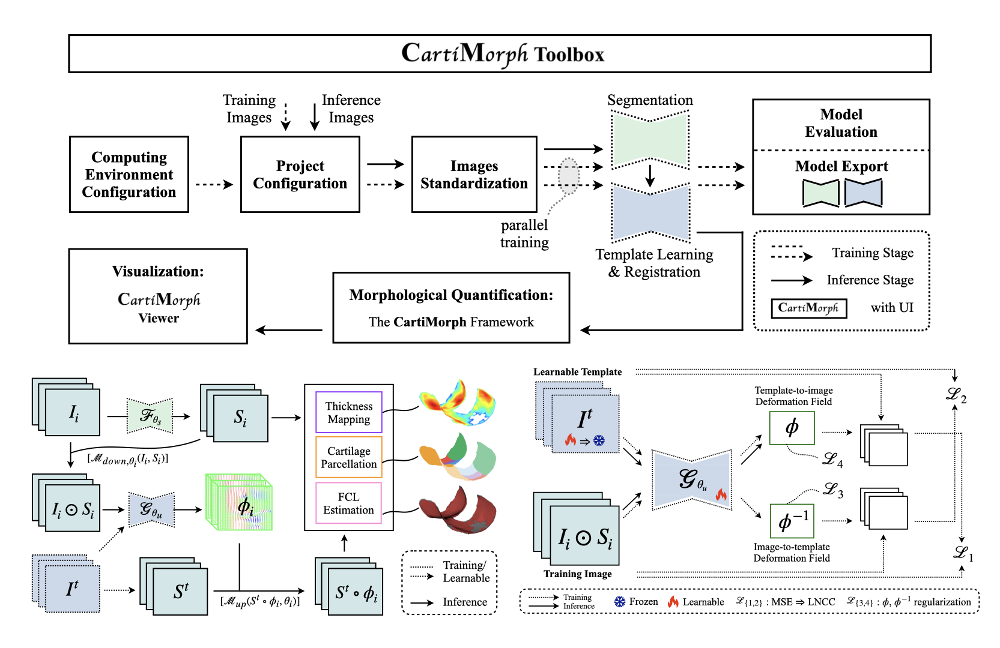

# CMT-AMAI24paper

## Paper

**Quantifying Knee Cartilage Shape and Lesion: From Image to Metrics**

[AMAI’24](https://sites.google.com/view/amai2024/home) (MICCAI workshop) (in press)



<br/><br/>

## TL;DR

[CMT](https://github.com/YongchengYAO/CartiMorph-Toolbox), a toolbox for knee MRI analysis, model training, and visualization.

<br/><br/>

## Contributions

- Joint Template-Learning and Registration Mode – **CMT-reg**
- CartiMorph Toolbox (CMT)

<br/><br/>

## :rocket: Models for CMT

- [models](https://github.com/YongchengYAO/CMT-AMAI24paper/tree/main/Models) (both for segmentation and registration) for this work – can be loaded into CMT
- more models from the [CMT models page](https://github.com/YongchengYAO/CartiMorph-Toolbox/blob/main/Models/model_releases.md)

<br/><br/>

## Quick Start

- For model evaluation and the training of other SoTA models:

```bash
git clone https://github.com/YongchengYAO/CMT-AMAI24paper.git
cd CMT-AMAI24paper
conda create --name CMT_AMAI24paper --file env.txt
```

- For model training in CMT, see the [instructions for CMT](https://github.com/YongchengYAO/CartiMorph-Toolbox?tab=readme-ov-file#step-by-step-instruction)

<br/><br/>

## Code

We compared the proposed **CMT-reg** with other template learning and/or registration models – Aladdin and LapIRN.

- [Code for Aladdin training, inference, and evaluation](https://github.com/YongchengYAO/CMT-AMAI24paper/tree/main/Code/Aladdin/Study) (for reproducing the results in Tables 2 & 3)
- [Code for LapIRN training, inference, and evaluation](https://github.com/YongchengYAO/CMT-AMAI24paper/tree/main/Code/LapIRN/Study)  (for reproducing the results in Tables 2 & 3)
- [Code for CMT evaluation](https://github.com/YongchengYAO/CMT-AMAI24paper/tree/main/Code/CMT_code4AMAI/study)  (for reproducing the results in Table 3)
- Training, inference, and evaluation of **CMT-reg** are implemented in CMT, set these parameters in CMT:
  - *Cropped Image Size*: 64, 128, 128
  - *Training Epoch*: 2000
  - *Network Width*: x3
  - *Loss*: MSE+LNCC

<br/><br/>

## :rocket: Data for Validation

**This is the data used for reproducing Tables 2 & 3.**

[Data for this repo](https://drive.google.com/drive/folders/1x_8vAgq8NRCKCoVBl-Y5jlk_kvfaYCdt?usp=sharing) for model training, inference, and evaluation

```
# data folder structure
├── Code
  ├── Aladdin
    ├── Model
  ├── LapIRN
    ├── Model
├── Data
  ├── Aladdin
  ├── CMT_data4AMAI 
  ├── LapIRN
```

- How to use files in the `Data` folder?
  1. clone this repo: `CMT-AMAI24paper`
  2. put the `Data` folder under `CMT-AMAI24paper/`
- How to use files in the `Code` folder?
  1. clone this repo: `CMT-AMAI24paper`
  2. put corresponding `Model` folders to
     - `CMT-AMAI24paper/Code/Aladdin/`
     - `CMT-AMAI24paper/Code/LapIRN/`

<br/><br/>

## Raw Data for Model Training

- MR Image: [OAI](https://nda.nih.gov/oai/)
- Annotation: OAI-ZIB

Data Information: [here](https://github.com/YongchengYAO/CMT-AMAI24paper/tree/main/DataInfo/OAIZIB) (link CMT-ID to OAI-SubjectID)

<br/><br/>

## :rocket: Preprocessed Data for Model Training: [OAIZIB-CM](https://drive.google.com/drive/folders/13_afAKSH7ZMOI_Nk2gfoihbJKwafw1l9?usp=sharing)

**This is the data used for training CMT-reg and nnUNet in CMT**

- | Source       | link                                                         |
  | ------------ | ------------------------------------------------------------ |
  | Google Drive | [here](https://drive.google.com/drive/folders/13_afAKSH7ZMOI_Nk2gfoihbJKwafw1l9?usp=share_link) |
  | Huggingface  | [here](https://huggingface.co/datasets/YongchengYAO/OAIZIB-CM/tree/main) |

  If you use our preprocessed data, please note that the manual segmentation annotations come from this work: 

  - Automated Segmentation of Knee Bone and Cartilage combining Statistical Shape Knowledge and Convolutional Neural Networks: Data from the Osteoarthritis Initiative (https://doi.org/10.1016/j.media.2018.11.009)

<br/><br/>

## Citation

```
(conference proceedings in press)
```

```
@misc{yao2024quantifyingkneecartilageshape,
      title={Quantifying Knee Cartilage Shape and Lesion: From Image to Metrics}, 
      author={Yongcheng Yao and Weitian Chen},
      year={2024},
      eprint={2409.07361},
      archivePrefix={arXiv},
      primaryClass={eess.IV},
      url={https://arxiv.org/abs/2409.07361}, 
}
```

<br/><br/>

## Acknowledgment

The training, inference, and evaluation code for Aladdin and LapIRN are adapted from these GitHub repos:

- Aladdin: https://github.com/uncbiag/Aladdin
- LapIRN: https://github.com/cwmok/LapIRN

CMT is based on CartiMorph: https://github.com/YongchengYAO/CartiMorph

```
@article{YAO2024103035,
title = {CartiMorph: A framework for automated knee articular cartilage morphometrics},
journal = {Medical Image Analysis},
author = {Yongcheng Yao and Junru Zhong and Liping Zhang and Sheheryar Khan and Weitian Chen},
volume = {91},
pages = {103035},
year = {2024},
issn = {1361-8415},
doi = {https://doi.org/10.1016/j.media.2023.103035}
}
```

